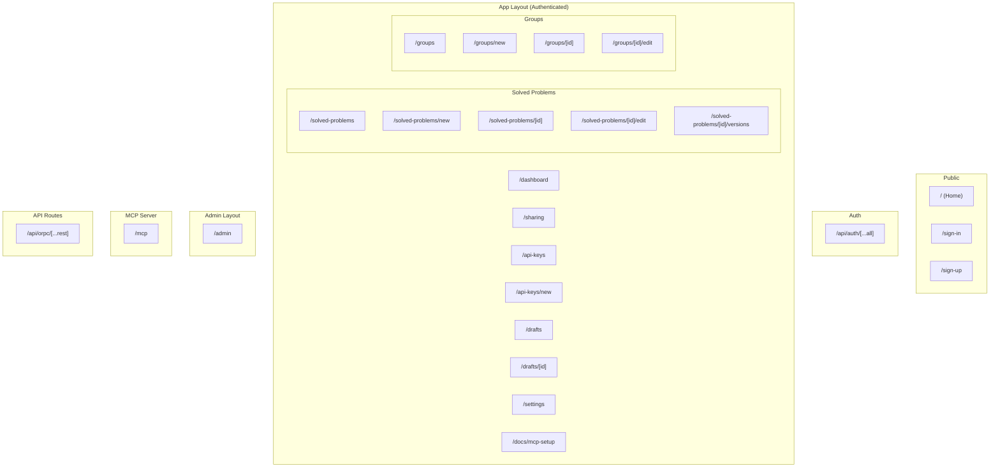

# Solved Problems MCP - Sitemap

## App Summary

**Domain**: Self-hosted MCP server for storing, versioning, and sharing reusable code solutions.

**User Roles**:
- **Admin**: First user to sign up; can configure site-wide settings (enable/disable signup)
- **Regular User**: All subsequent users

---

## Hierarchical Sitemap

---

## Page Details

| Path | Title | SSR | Auth Required | Roles | Layout |
|------|-------|-----|---------------|-------|--------|
| `/` | Home | true | true (redirects to /sign-in if unauthenticated) | [] | app |
| `/docs/mcp-setup` | Getting Started / MCP Setup | true | true | [] | app |
| `/sign-in` | Sign In | true | false | [] | public |
| `/sign-up` | Sign Up | true | false | [] | public |
| `/dashboard` | Dashboard | true | true | [] | app |
| `/solved-problems` | Solved Problems | true | true | [] | app |
| `/solved-problems/new` | Create Solved Problem | true | true | [] | app |
| `/solved-problems/[id]` | Solved Problem Details | true | true | [] | app |
| `/solved-problems/[id]/edit` | Edit Solved Problem | true | true | [] | app |
| `/solved-problems/[id]/versions` | Version History | true | true | [] | app |
| `/groups` | Groups | true | true | [] | app |
| `/groups/new` | Create Group | true | true | [] | app |
| `/groups/[id]` | Group Details | true | true | [] | app |
| `/groups/[id]/edit` | Edit Group | true | true | [] | app |
| `/sharing` | Sharing | true | true | [] | app |
| `/api-keys` | API Keys | true | true | [] | app |
| `/api-keys/new` | Create API Key | true | true | [] | app |
| `/drafts` | Drafts | true | true | [] | app |
| `/drafts/[id]` | Draft Details | true | true | [] | app |
| `/settings` | Settings | true | true | [] | app |
| `/admin` | Admin Settings | true | true | ["admin"] | admin |

---

## API Endpoints

| Path | Description | Auth Method |
|------|-------------|-------------|
| `/api/auth/[...all]` | Better Auth endpoints | Session cookie |
| `/api/orpc/[...rest]` | oRPC API | Session cookie |
| `/mcp` | MCP Server (Streamable HTTP) | Bearer token (API key) |

---

## Notes

- **Home Page (`/`)**: Redirects to `/sign-in` if unauthenticated. If authenticated, displays:
  - Recently-used solved problems
  - Drafts pending review
  - Quick links to create new solved problems
- **SSR/CSR**: Most pages are SSR for initial load performance. The MCP endpoint uses Streamable HTTP transport.
- **Authentication**: Better Auth credentials; MCP uses `Authorization: Bearer <api-key>` header
- **Role constraints**: Only admin users can access `/admin`
- **Error states**: Should include 404, 403, 500 error pages
- **Empty states**: Each list page should have empty states when no data exists
- **External Docs (`apps/docs/`)**: A separate Astro Starlight site serving full public documentation (deployment, hosting, configuration, etc.). The in-app `/docs/mcp-setup` page covers only the basics for getting up and running (creating API keys, configuring MCP in your editor) and does not include deployment/hosting information.
